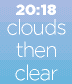

Gradient Weather
==============

This is the source repositor for the Pebble watchapp "Gradient Weather"

The app can be found in the store: https://apps.getpebble.com/applications/55df54f2e016bd114b000058

#Screenshots

#Features
- 12/24h time
- Shows the current and 3h weather forecast in textual form and using a color background.

#Credits
Credits go to adrianchifor (https://github.com/adrianchifor/authentic-weather-pebble) from which I forked this. And to Mathew Reiss for his incredibly simple to use dithering library (https://github.com/MathewReiss/dithering)

